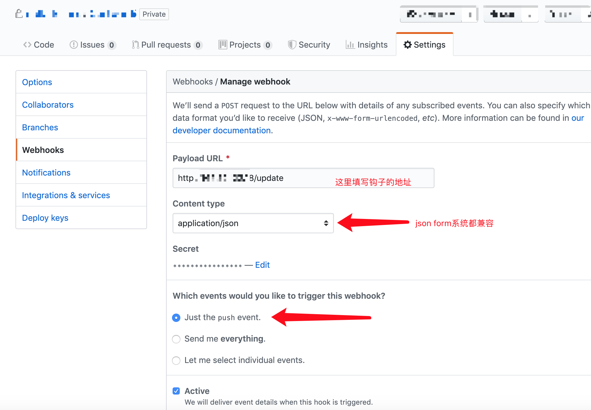
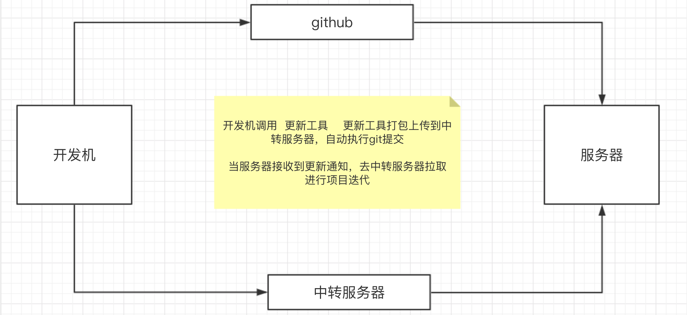

# easydevops
easydevops 最小化的自动构建部署


### 如何使用
运行 .api 文件 

第一次运行会生成config.yml 配置文件

填写完成后 检查填写是否正确   如果正确就再次运行

未来新添加 直接 在配置文件添加 然后重启 api文件 即可


### 配置文件夹讲解
``` 
devops:
  node:
    - port: "8086"                             # 程序运行端口
      full_name: "dollarkillerx/easyutils"     # 名称 例如 dollarkillerx/easyutils
      branch: "es"                             # 分支
      giturl: "https://github.sads"            # git pull url 地址 (你要先配置一下秘钥啊!)
      runname: "dollarki"                      # 运行程序的name
      dirpath: "/asdasd/asdasdasd"             # 项目的路径   绝对路径
      secondarydirectory: ""                   # 如果执行程序在二级目录中 请填写(相对路径)
    - port: "8082"     
      full_name: "dollarkillerx/easyutils"     
      branch: "us"     
      giturl: "https://github.sads"    
      runname: "dollarki"   
      dirpath: "/asdasd/asdasdasd/us"   
      secondarydirectory: "/asdsaadsad"  
```

### 基础 教程
- 程序默认webhook地址: http://0.0.0.0:8083/update
- 先去github 添加钩子



- 第一次运行程序 会生成config.yml 文件 用户只需填写  启动即可 (请认真检查啊)

- 如果添加网站呢？ 直接添加到配置文件即可  然后重启服务就行

### GoWith (解决  github包过大问题)



注： 暂不支持 win  (仅支持mac  or linux)

``` 
.
├── LICENSE
├── README
│   ├── gowith.png
│   └── one.png
├── README.md
├── client                # 部署客户端
│   ├── api
│   │   ├── api
│   │   ├── config.yml
│   │   ├── controller
│   │   │   └── main.go
│   │   ├── devops.sh
│   │   ├── httprouter_registered
│   │   │   └── httprouter.go
│   │   ├── main.go
│   │   ├── router
│   │   │   └── app.go
│   │   └── sh
│   ├── config
│   │   └── config.go
│   ├── defs
│   │   └── githubapi.go
│   ├── initialization
│   │   └── initialization.go
│   └── test
│       ├── fmt_test.go
│       ├── master.json
│       ├── test.json
│       ├── testkill.sh
│       └── tmp
├── cmd                # 提交cli 工具
│   ├── cmd
│   ├── config
│   │   └── config.go
│   ├── config.yml
│   ├── logic
│   │   └── logic_main.go
│   ├── main.go
│   └── test
├── common
│   └── resp.go
├── config.yml
├── go.mod
├── go.sum
├── server           # 任务中心
│   ├── config
│   │   └── config.go
│   └── web
│       ├── config.yml
│       ├── controller
│       │   └── main_controller.go
│       ├── file
│       ├── httprouter_registered
│       │   └── httprouter.go
│       ├── main.go
│       ├── routers
│       │   └── app.go
│       └── web
├── test
│   └── one_test.go
└── utils
    └── utils.go
```


